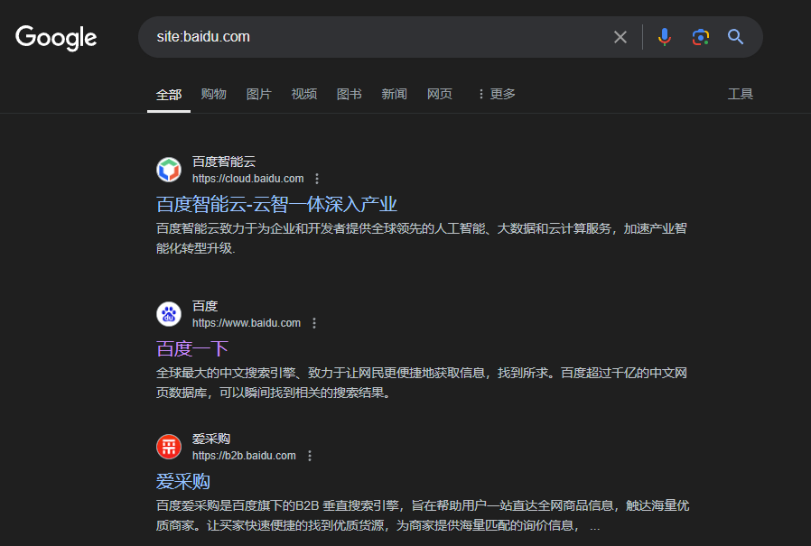
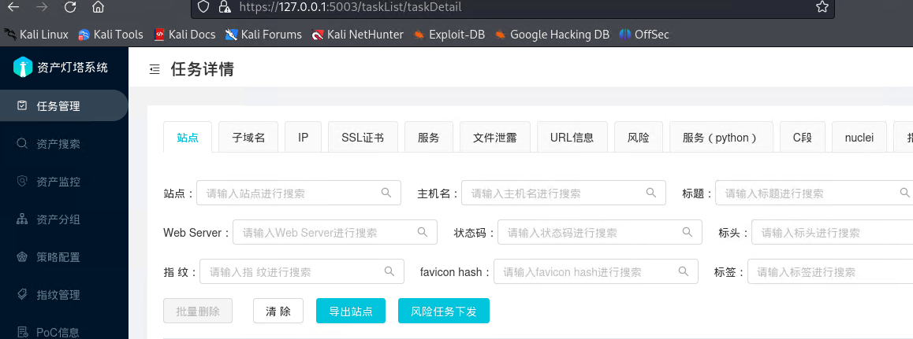

### 信息收集
被动信息收集利用第三方服务对目标进行信息收集：google搜索引擎，社交媒体，公共记录等，不与目标系统直接交互。

#### 信息收集内容
- IP地址
  - 多ip，cdn加速找真实ip，同ip资产，旁站，同网段
- 域名信息
  - DNS历史解析，注册信息，备案信息，子域名挖掘
- 邮件地址
    - 钓鱼攻击
- 文档图片数据
  - 第三方存储服务相关信息
- 系统架构以及应用识别
  - 系统类型（linux，window），端口，服务，版本，编程语言，数据库，web中间件，编辑器，cms类型
- 网站源码以及接口路径

##### dns解析查询
```
nslookup xxxx.com

┌──(kali㉿kali)-[~/Desktop]
└─$ nslookup baidu.com 
Server:         192.168.45.2
Address:        192.168.45.2#53

Non-authoritative answer:
Name:   baidu.com
Address: 39.156.66.10
Name:   baidu.com
Address: 110.242.68.66
```
##### 负载均衡查询
```
lbd xxxx.com
```

##### dns记录查询
```
dig xxx.com
dig +trace dns追踪


┌──(kali㉿kali)-[~/Desktop]
└─$ dig +trace baidu.com 

; <<>> DiG 9.19.21-1+b1-Debian <<>> +trace baidu.com
;; global options: +cmd
.                       5       IN      NS      m.root-servers.net.
.                       5       IN      NS      i.root-servers.net.
.                       5       IN      NS      f.root-servers.net.
.                       5       IN      NS      j.root-servers.net.
.                       5       IN      NS      h.root-servers.net.
.                       5       IN      NS      g.root-servers.net.
.                       5       IN      NS      d.root-servers.net.
.                       5       IN      NS      a.root-servers.net.
.                       5       IN      NS      l.root-servers.net.
.                       5       IN      NS      c.root-servers.net.
.                       5       IN      NS      e.root-servers.net.
.                       5       IN      NS      b.root-servers.net.
.                       5       IN      NS      k.root-servers.net.
.                       5       IN      
.........

baidu.com.              600     IN      A       39.156.66.10
baidu.com.              600     IN      A       110.242.68.66
baidu.com.              86400   IN      NS      ns4.baidu.com.
baidu.com.              86400   IN      NS      ns2.baidu.com.
baidu.com.              86400   IN      NS      ns3.baidu.com.
baidu.com.              86400   IN      NS      dns.baidu.com.
baidu.com.              86400   IN      NS      ns7.baidu.com.
;; Received 356 bytes from 110.242.68.134#53(ns1.baidu.com) in 211 ms

```
##### 第三方服务平台查询相关信息
fofa shodan 360quake

#### 子域名收集

##### 搜索引擎挖掘
```
site:baidu.com
```

##### 第三方网站查询
- https://dnsdumpster.com/
- http://tools.chinaz.com/subdomain
- https://crt.sh
##### 子域名挖掘机 Layer

#### ARL资产侦察灯塔系统搭建使用
笔者在学习记录的时候，ARL已经停止维护开源项目，具体的停止原因声明如下:
https://mp.weixin.qq.com/s/hM3t3lYQVqDOlrLKz3_TSQ

以及官方仓库备份项目地址:

https://github.com/Aabyss-Team/ARL

按照项目提示即可完成部署docker版ARL


